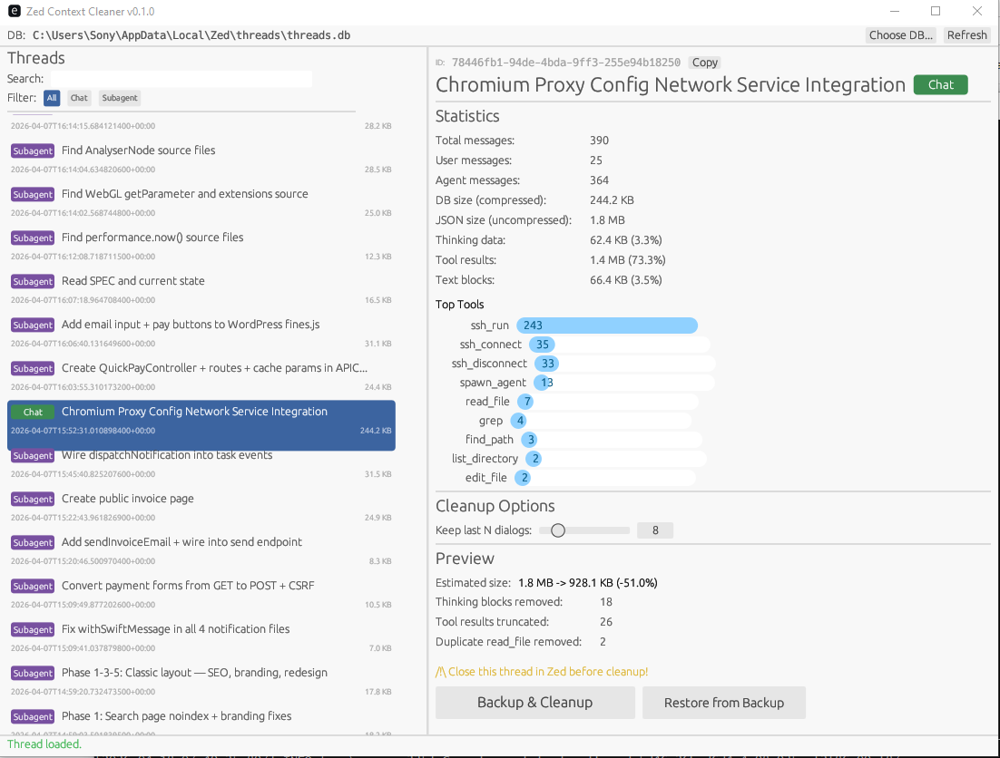
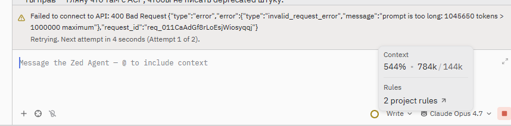

# Zed Context Cleaner

A desktop utility for cleaning and compressing Zed IDE AI chat history stored in `threads.db`. Removes `Thinking` blocks, truncates large `tool_results`, nulls out `initial_project_snapshot`, and recalculates token usage — all without losing your actual conversation context.



## Why You Need This

Zed stores every AI chat thread as a JSON blob (optionally zstd-compressed) in a SQLite database. Over time, threads balloon in size due to:

- **Thinking blocks** — Claude's internal reasoning, often hundreds of KB per message
- **Tool results** — `terminal`, `read_file`, `grep` outputs that can be megabytes each
- **Project snapshots** — large initial context dumps attached to the thread

A single long thread can easily reach 5-20 MB. When the context grows too large, Zed starts throwing errors:



- **Failed to connect to API: 400 Bad Request** — `invalid_request_error: prompt is too long: N tokens > 1000000 maximum`
- **Error: Failed to generate summary**
- **max token limit reached**
- **prompt token count exceeds**
- **model_max_prompt_tokens_exceeded**

This tool fixes these errors by compressing the thread context — surgically removing the bloat while keeping everything you actually care about: your messages, the agent's responses, and file edits. After cleanup, you can continue working with the thread normally. Context window size updates after the first message in the cleaned thread.

---

## Requirements

- **Rust toolchain** 1.75 or newer — install via [rustup](https://rustup.rs/)
- Windows, macOS, or Linux
- Zed IDE installed (so `threads.db` exists)

### Platform-specific dependencies

**Linux** — you may need to install development packages for the GUI:

```sh
# Debian/Ubuntu
sudo apt install libxcb-render0-dev libxcb-shape0-dev libxcb-xfixes0-dev libxkbcommon-dev libssl-dev libgtk-3-dev

# Fedora
sudo dnf install libxcb-devel libxkbcommon-devel openssl-devel gtk3-devel

# Arch
sudo pacman -S libxcb libxkbcommon openssl gtk3
```

**Windows** and **macOS** — no extra dependencies needed.

---

## Building

```sh
git clone https://github.com/pmboxbiz/zed-context-cleaner.git
cd zed-context-cleaner
cargo build --release
```

The compiled binary will be at:

| Platform      | Path                                      |
|---------------|-------------------------------------------|
| Windows       | `target\release\zed-context-cleaner.exe`  |
| macOS / Linux | `target/release/zed-context-cleaner`      |

---

## Usage

The tool has two modes: **GUI** (default) and **CLI** (when arguments are provided).

### GUI Mode

Simply launch the binary without arguments:

```sh
# Windows
.\target\release\zed-context-cleaner.exe

# macOS / Linux
./target/release/zed-context-cleaner
```

The app will automatically find `threads.db` at the default location for your OS:

| Platform | Default path                                              |
|----------|-----------------------------------------------------------|
| Windows  | `%LOCALAPPDATA%\Zed\threads\threads.db`                   |
| macOS    | `~/Library/Application Support/Zed/threads/threads.db`    |
| Linux    | `~/.local/share/zed/threads/threads.db`                   |

If your database is elsewhere, click **Choose DB...** in the top bar.

#### GUI Workflow

1. **Launch the app.** The left panel loads your thread list automatically.
2. **Filter and search.** Use the search box and filter buttons (All / Chat / Subagent) to find threads.
3. **Select a thread.** The right panel shows detailed statistics:
   - Total messages, DB size, uncompressed JSON size
   - Breakdown: how many bytes are Thinking blocks, tool results, text
   - Top tools by call count
4. **Adjust the slider** — *Keep last N dialogs* (default: 10). The last N conversation pairs (User → Agent) will not be touched.
5. The **Preview** section updates instantly, showing estimated size reduction.
6. Click **Backup & Cleanup** to apply. A confirmation dialog will remind you to close the thread in Zed first.
7. After cleanup, a result dialog shows before/after sizes and the backup filename.
8. To undo, click **Restore from Backup** and select a previous backup.

### CLI Mode

Pass a command as the first argument to skip the GUI entirely:

```
zed-context-cleaner list                          List all threads
zed-context-cleaner clean <thread_id>             Backup & clean a thread by ID
zed-context-cleaner clean <title>                 Search by title and clean
zed-context-cleaner clean <id_or_title> -n 5      Keep last 5 dialogs (default: 10)
zed-context-cleaner restore <backup_file>         Restore a thread from a backup JSON file
zed-context-cleaner help                          Show usage information
```

#### Examples

**List all threads:**

```sh
zed-context-cleaner list
```

Output:

```
ID                                       Type       Size     Summary
----------------------------------------------------------------------------------------------------
a1b2c3d4-5678-90ab-cdef-1234567890ab     Chat       189.1 KB My Project Implementation
e5f6a7b8-9012-34cd-ef56-7890abcdef12     Chat       266.8 KB Bug Fix and Refactoring Session
...
Total: 816 threads
```

**Clean a thread by ID:**

```sh
zed-context-cleaner clean a1b2c3d4-5678-90ab-cdef-1234567890ab
```

**Clean a thread by title (case-insensitive substring match):**

```sh
zed-context-cleaner clean "Frontend Redesign"
```

If multiple threads match, the tool lists them and asks you to be more specific.

**Clean keeping only last 5 dialogs:**

```sh
zed-context-cleaner clean "Frontend Redesign" -n 5
```

**Restore from backup:**

```sh
zed-context-cleaner restore a1b2c3d4-5678-90ab-cdef-1234567890ab_Frontend_Redesign_20250416_190000.json
```

The tool looks for the file in the current directory first, then in the `backups/` directory next to the executable. The thread ID is extracted from the filename automatically.

---

## Important: Close the Thread in Zed First

**Before cleaning or restoring a thread, close it in Zed IDE.**

Zed keeps the active thread in memory. If you clean the database while the thread is open in Zed, Zed will overwrite your cleaned version with the in-memory copy when it next saves — undoing all the work.

Steps:
1. In Zed, switch to a different thread (or close the AI panel).
2. Run the cleanup in this tool (GUI or CLI).
3. Reopen the thread in Zed.

Context window size will update after the first message in the reopened thread.

---

## Backups

Before writing any changes, the app saves the original thread JSON to a `backups/` folder next to the executable:

```
zed-context-cleaner.exe
backups/
  b7062448-5893-4c6a-848d-158441b7ddce_My_Thread_Title_20260115_143201.json
  b7062448-5893-4c6a-848d-158441b7ddce_My_Thread_Title_20260116_091045.json
```

Filename format: `<thread_id>_<sanitized_title>_<YYYYMMDD_HHMMSS>.json`

Backups are raw uncompressed JSON, readable in any text editor.

---

## What Gets Cleaned

### Tool Results

| Tool              | Action                       |
|-------------------|------------------------------|
| `terminal`        | Truncated to **2,000 bytes** |
| `ssh_run`         | Truncated to **2,000 bytes** |
| `ssh_connect`     | Truncated to **2,000 bytes** |
| `read_file`       | Truncated to **3,000 bytes** |
| `grep`            | Truncated to **2,000 bytes** |
| `find_path`       | Truncated to **2,000 bytes** |
| `list_directory`  | Truncated to **2,000 bytes** |
| `edit_file`       | **Kept in full**             |
| `create_directory` | **Kept in full**            |
| `copy_path`       | **Kept in full**             |
| `move_path`       | **Kept in full**             |
| `delete_path`     | **Kept in full**             |
| `save_file`       | **Kept in full**             |
| `spawn_agent`     | **Kept in full**             |

Truncated results get a suffix: `... [TRUNCATED: N bytes omitted]`

### Other Cleanup

| Field                          | Action                                                         |
|--------------------------------|----------------------------------------------------------------|
| `Thinking` blocks              | Removed from non-protected agent messages                      |
| `RedactedThinking` blocks      | Removed from non-protected agent messages                      |
| `reasoning_details`            | Set to `null`                                                  |
| `initial_project_snapshot`     | Set to `null`                                                  |
| Duplicate `read_file` results  | Replaced with placeholder; only the **last** call is kept      |
| `request_token_usage`          | Recalculated (orphaned entries removed)                        |
| `cumulative_token_usage`       | Recalculated from remaining usage entries                      |

### What Is Never Touched

- User messages (your text)
- Agent `Text` blocks (the actual response)
- `ToolUse` blocks (the tool call records)
- The last **N** conversation pairs (configurable via slider or `-n` flag)

---

## Thread Types

The tool classifies threads into two types:

- **Chat** (green badge) — Main threads started by you. This includes threads where the agent used tools.
- **Subagent** (purple badge) — Child threads spawned by `spawn_agent`. These have a non-null `subagent_context` field.

Use the filter buttons in the GUI or the `list` command in CLI to browse by type.

---

## Logging

The application writes detailed logs to `zed-context-cleaner.log` next to the executable. This is useful for debugging issues with thread loading or cleanup.

---

## Python Tools

The `python/` directory contains standalone Python scripts that work with the same `threads.db` database. These were the original prototypes and remain useful as quick command-line utilities.

### Requirements

```sh
pip install zstandard
```

### `python/zed_thread.py` — Read/Write/List threads

```sh
# List all threads
python python/zed_thread.py list

# Export a thread to JSON file
python python/zed_thread.py read "<thread_id>" output.json

# Import a JSON file back into the database
python python/zed_thread.py write "<thread_id>" input.json
```

### `python/zed_cleanup.py` — Clean a thread (standalone)

```sh
# Clean with default settings (keep last 10 dialogs)
python python/zed_cleanup.py input.json output.json

# Dry run (show stats without saving)
python python/zed_cleanup.py input.json output.json --dry-run

# Keep last 5 dialogs
python python/zed_cleanup.py input.json output.json --keep=5
```

### `python/analyze.py` — Analyze thread structure

Reads a JSON thread file and prints size breakdown by content type and tool call counts. Edit the filename at the top of the script (`1.json` by default).

```sh
python python/analyze.py
```

> **Note:** The Python scripts auto-detect the `threads.db` path based on your OS. To override, set the `ZED_THREADS_DB` environment variable to your custom path.

---

## Project Structure

```
zed-context-cleaner/
├── src/
│   ├── main.rs        — entry point, CLI commands, GUI launch
│   ├── app.rs         — GUI application (egui/eframe)
│   ├── db.rs          — SQLite operations, zstd compression
│   ├── cleaner.rs     — cleanup logic, statistics, preview
│   └── types.rs       — data structures (serde)
├── python/
│   ├── zed_thread.py  — read/write/list threads (Python)
│   ├── zed_cleanup.py — standalone cleanup script (Python)
│   └── analyze.py     — thread structure analyzer (Python)
├── Cargo.toml
├── README.md
└── CHANGELOG.md
```

---

## Running Tests

```sh
cargo test
```

The test suite covers:
- Thinking block removal
- Thinking block preservation in protected dialogs
- Tool result truncation
- Preserve-tools not truncated
- Duplicate read_file deduplication
- Token usage recalculation
- Initial snapshot nulling
- Reasoning details removal

---

## License

MIT